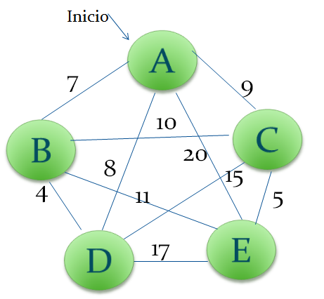

# Genere el algoritmo genetico de [Grafo]

Inserta la imagen de la carpeta assets: 

## Table del Grafo y sus caminos

| | A | B | C | D | E|
|---|---|---|---|---|---|
| A | 0 | 7 | 9 | 8 | 20 |
| B | 7 | 0 | 10 | 8 | 11 |
| C | 9 | 10 | 0 | 15 | 5 |
| D | 8 | 8 | 15 | 0 | 17 |
| E | 20 | 11 | 5 | 17 | 0 |
